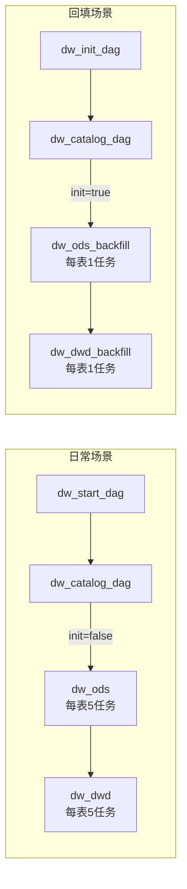

# 回填优化方案（独立 Backfill DAG）

## 目标

- 回填时减少 Airflow 任务数量与 DuckDB 连接初始化次数，显著提升性能。
- 日常运行保持原有行为完全不变。
- 不修改分区约定、提交协议与核心调度链路。

## 背景问题

当前回填通过日常 `dw_*` DAG 的动态映射按天拆分任务，导致：
- 任务数量 = 分区数量 × 5（prepare/load/validate/commit/cleanup）。
- 每分区都初始化 DuckDB 连接与 httpfs 配置。
- S3 list/copy/delete 操作固定开销成为瓶颈。

**示例**：回填 90 天数据，单表会产生 90 × 5 = 450 个任务，初始化 90 个 DuckDB 连接。

## 方案概述（方案 D：独立 Backfill DAG）

创建独立的回填专用 DAG，与日常 DAG 完全分离：
- **日常 DAG**：`dw_ods`, `dw_dwd`, `dw_dim` 等（保持不变）
- **回填 DAG**：`dw_ods_backfill`, `dw_dwd_backfill`, `dw_dim_backfill` 等（新增）

### 架构图



### 任务结构对比

| 场景 | DAG | 每表任务数 | 处理逻辑 | DuckDB 连接 |
|------|-----|-----------|---------|------------|
| 日常 | `dw_ods` | 5 个/日（prepare/load/validate/commit/cleanup） | 单个分区 | 每日1个连接 |
| 回填 | `dw_ods_backfill` | 1 个（内部循环） | 多个分区，复用连接 | 全表1个连接 |

## 核心优化

### 1. 任务数量优化

**当前（日常 DAG 用于回填）**：
```
90 天 × 5 步骤 = 450 个任务/表
```

**方案 D（独立 Backfill DAG）**：
```
1 个任务/表（内部循环处理 90 天）
```

### 2. DuckDB 连接复用

```python
# 回填 DAG 的核心逻辑
with temporary_connection() as connection:
    configure_s3_access(connection, s3_config)
    
    for partition_date in dates:  # 循环处理所有日期
        # prepare -> load -> validate -> commit -> cleanup
        metrics = pipeline_load(
            connection=connection,  # 关键：复用同一个连接
            ...
        )
```

### 3. 性能对比

| 指标 | 日常 DAG（90天） | Backfill DAG（90天） | 提升 |
|------|-----------------|---------------------|------|
| 任务数 | 450 个 | 1 个 | -99% |
| DuckDB 连接数 | 90 个 | 1 个 | -98% |
| Airflow 调度开销 | 高 | 极低 | -95% |
| 预期总耗时 | 基准 | -50% ~ -70% | 显著 |

## 不变约束

- 分区命名仍为 `dt=YYYY-MM-DD`。
- Commit protocol 不变：`delete_prefix -> copy_prefix -> manifest/_SUCCESS`。
- SQL 模板继续使用 `${PARTITION_DATE}`。
- T-1 逻辑（`get_partition_date_str()`）不变。
- 表依赖关系完全一致。

## 新增参数（dag_run.conf）

### dw_init_dag 参数

| 参数 | 类型 | 默认值 | 说明 |
|------|------|--------|------|
| `start_date` | string | 必填 | 回填起始日期（YYYY-MM-DD） |
| `end_date` | string | 必填 | 回填结束日期（YYYY-MM-DD，含） |
| `targets` | array | `[]` | 目标表过滤（如 `["ods.fund_etf_spot"]`），空表示全部 |
| `batch_size` | integer | `30` | 保留参数（当前未使用，预留给未来优化） |
| `continue_on_error` | boolean | `false` | 单日失败时是否继续处理后续日期 |

### 参数说明

- **`continue_on_error=false`（推荐）**：任一日期失败即终止，便于排查问题。
- **`continue_on_error=true`**：记录失败日期并继续，适合宽松场景（需手动补跑失败日期）。

## 文件清单

### 新增文件

1. **`dags/dw_dags_backfill.py`**（核心）
   - `backfill_table_range()` - 回填执行函数
   - `create_layer_backfill_dag()` - DAG 生成器
   - `build_backfill_dags()` - 批量生成所有层的回填 DAG

### 修改文件

2. **`dags/dw_catalog_dag.py`**
   - 添加 `decide_dag_type()` 分支任务
   - 根据 `init` 参数触发 `dw_ods` 或 `dw_ods_backfill`

3. **`dags/dw_init_dag.py`**
   - 添加 `batch_size` 和 `continue_on_error` 参数
   - 设置 `init=True` 标记

### 保持不变

- **`dags/dw_dags.py`** - 日常 DAG（完全不动）
- **`dags/dw_start_dag.py`** - 日常触发（完全不动）
- **`dags/utils/etl_utils.py`** - 工具函数（完全不动）
- 所有 SQL 文件、配置文件

## 使用方式

### 1. 日常运行（不变）

通过 Airflow UI 触发 `dw_start_dag`，或等待定时调度：

```python
# dw_start_dag 会自动触发 dw_catalog_dag
# dw_catalog_dag 检测到 init=False，触发 dw_ods（日常 DAG）
```

**不需要任何改动**，日常运行完全不受影响。

### 2. 回填运行（新方式）

通过 Airflow UI 触发 `dw_init_dag`，配置参数：

```json
{
  "start_date": "2024-01-01",
  "end_date": "2024-03-31",
  "targets": [],
  "batch_size": 30,
  "continue_on_error": false
}
```

**执行流程**：
```
dw_init_dag 
  → dw_catalog_dag (检测 init=True)
    → dw_ods_backfill (每表1任务)
      → dw_dwd_backfill (每表1任务)
        → dw_dim_backfill (每表1任务)
          → dw_finish_dag
```

### 3. 回填单个表

```json
{
  "start_date": "2024-12-01",
  "end_date": "2024-12-07",
  "targets": ["ods.fund_etf_spot"],
  "continue_on_error": false
}
```

只会处理 `ods.fund_etf_spot` 表，其他表会跳过。

## 错误处理与日志

### continue_on_error=false（默认，推荐）

- 批内任一日期失败即**立即终止**该表的回填。
- 任务标记为失败，便于在 Airflow UI 中发现。
- 适合生产环境，确保数据质量。

### continue_on_error=true（宽松模式）

- 单日失败记录到 `failed_dates` 列表，继续处理后续日期。
- 任务返回成功，但日志中包含失败列表。
- 需要手动检查日志，补跑失败日期。

### 日志示例

```
[Backfill] Starting backfill for ods.fund_etf_spot: 90 dates (2024-01-01 to 2024-03-31)
[Backfill] Processing ods.fund_etf_spot dt=2024-01-01
[Backfill] Completed ods.fund_etf_spot dt=2024-01-01: 1234 rows, 1 files
[Backfill] Processing ods.fund_etf_spot dt=2024-01-02
...
[Backfill] Summary for ods.fund_etf_spot: 90 succeeded, 0 failed out of 90 total dates
```

## 兼容性与回滚

### 兼容性

- ✅ 日常 DAG 完全不变，日常运行零影响。
- ✅ 可以同时运行日常和回填 DAG（不同的日期范围）。
- ✅ 回填 DAG 产出与日常 DAG 完全一致（相同的 SQL、相同的提交协议）。

### 回滚策略

如果回填 DAG 有问题：
1. 删除 `dags/dw_dags_backfill.py`
2. 恢复 `dags/dw_catalog_dag.py` 的分支逻辑（直接触发 `dw_ods`）
3. 日常运行完全不受影响
4. 临时回填可通过以下方式之一：
   
   **方式 A（推荐）**：手动多次触发 `dw_start_dag`，修改 Airflow 时间：
   ```bash
   # 使用 Airflow UI 手动触发，逐日修改 execution_date
   # 或使用 CLI 逐日触发（注意 T-1 逻辑会处理前一天）
   for date in $(seq 0 89); do
       airflow dags trigger dw_start_dag --exec-date "2024-01-0$(($date + 2))"
   done
   ```
   
   **方式 B**：临时修改 `lakehouse_core/io/time.py` 的 `get_partition_date_str()`：
   ```python
   # 临时改为从环境变量读取（记得回填完后恢复）
   def get_partition_date_str() -> str:
       override = os.getenv("PARTITION_DATE_OVERRIDE")
       if override:
           return override
       return (date.today() - timedelta(days=1)).isoformat()
   ```
   
   **不推荐**：直接使用 `airflow dags backfill`，因为该命令使用 `{{ ds }}`，与项目 T-1 约定不一致，可能导致数据错位。

## 验证建议

### 1. 小范围测试

选取单表、小范围日期（如 7 天）做回填测试：

```json
{
  "start_date": "2024-12-01",
  "end_date": "2024-12-07",
  "targets": ["ods.fund_etf_spot"],
  "continue_on_error": false
}
```

### 2. 对比验证

- 日常 DAG 运行 7 次 vs 回填 DAG 运行 1 次
- 验证产出的 parquet 文件一致（文件数、行数、内容）
- 验证 `manifest.json` 和 `_SUCCESS` 标记完整性

### 3. 性能验证

- 对比任务数量：450 个 vs 1 个
- 对比总耗时：预期减少 50-70%
- 检查 DuckDB 连接数：90 个 vs 1 个

### 4. 错误处理验证

- 模拟单日失败（如删除 RAW 数据）
- 验证 `continue_on_error=false` 时任务终止
- 验证 `continue_on_error=true` 时继续处理

## 执行示例

### 示例 1：回填 90 天全部表

```json
{
  "start_date": "2024-01-01",
  "end_date": "2024-03-31",
  "targets": [],
  "batch_size": 30,
  "continue_on_error": false
}
```

### 示例 2：回填单个 ODS 表

```json
{
  "start_date": "2024-12-01",
  "end_date": "2024-12-31",
  "targets": ["ods.fund_etf_spot"],
  "continue_on_error": false
}
```

### 示例 3：回填整个 DWD 层

```json
{
  "start_date": "2024-11-01",
  "end_date": "2024-11-30",
  "targets": ["dwd"],
  "continue_on_error": true
}
```

## 业界实践对比

| 方案 | 本项目 | dbt | Databricks | Airflow 官方建议 |
|------|--------|-----|------------|-----------------|
| 回填方式 | 独立 Backfill DAG | `dbt run --full-refresh` | 独立 Job | CLI backfill 或独立 DAG |
| 任务结构 | 分离 | 独立命令 | 分离 | 分离 |
| 连接复用 | ✅ | ✅ | ✅ | - |
| 符合最佳实践 | ✅ | ✅ | ✅ | ✅ |

**结论**：方案 D 与业界主流实践一致，优于在单一 DAG 中用 branch 区分回填和日常。

## 后续优化空间

1. **并行回填多个表**：如果表之间没有依赖，可以并行处理（调整 `max_active_tasks`）。
2. **智能批次大小**：根据表大小自动调整内部循环批次。
3. **断点续传**：记录已完成的日期，失败后可从中断处继续。
4. **进度监控**：实时报告回填进度（X/Y 日期完成）。
5. **增量回填**：只回填缺失的分区，跳过已存在的分区。

## 常见问题

### Q1: 为什么不使用 Airflow 的 branch + dynamic mapping？

**A**: 
- Branch + dynamic mapping 适合"运行时条件分支"，不适合"场景选择"（回填 vs 日常）。
- 业界主流做法是分离回填和日常的编排单元。
- 独立 DAG 更简单、清晰、易维护。

### Q2: 回填 DAG 会影响日常运行吗？

**A**: 完全不会。日常 DAG（`dw_ods`）代码完全不变，回填 DAG（`dw_ods_backfill`）是独立的新文件。

### Q3: 可以同时运行日常和回填吗？

**A**: 可以，只要日期范围不重叠。Commit protocol 使用 `run_id` 区分临时路径，不会冲突。

### Q4: 回填失败了怎么办？

**A**: 
- 检查日志中的 `failed_dates` 列表
- 修复问题后，用相同的参数重新触发 `dw_init_dag`
- 或者手动触发 `dw_ods_backfill`，只填 `targets` 和失败的日期范围

### Q5: batch_size 参数有什么用？

**A**: 当前保留未使用，预留给未来优化（如分批提交、进度检查点等）。
